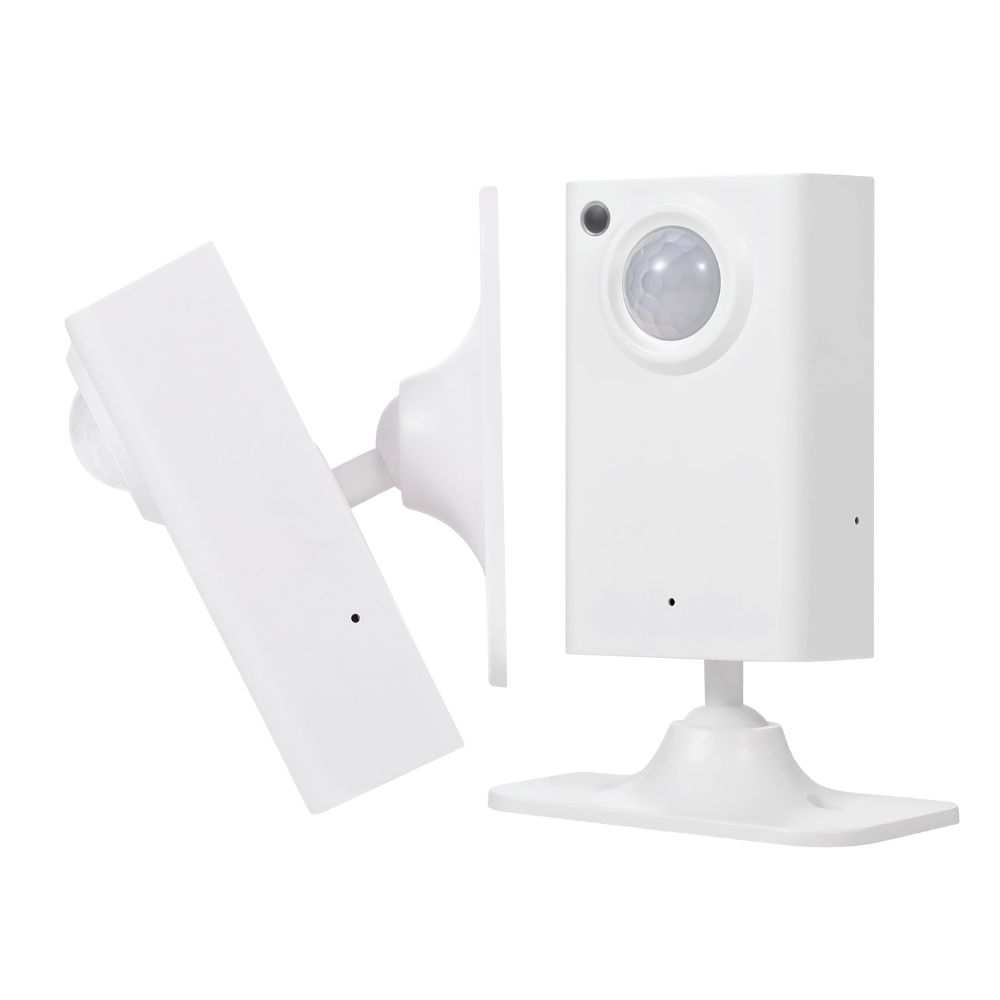

# Blakadder's ESPHome Configurations

 &emsp; 

## athom_ps01.yaml

Confguration for Athom mmWave Human Presence sensor (PS01). 

Buy from [AliExpress](https://www.aliexpress.com/item/1005005772833515.html?aff_fcid=d53394c247264642ac0a1bfc1c85b3d0-1689887810797-02952-_DeSN8DB&tt=CPS_NORMAL&aff_fsk=_DeSN8DB&aff_platform=shareComponent-detail&sk=_DeSN8DB&aff_trace_key=d53394c247264642ac0a1bfc1c85b3d0-1689887810797-02952-_DeSN8DB&terminal_id=165068c405fe431e83f4b86336c9e8c9&afSmartRedirect=y)

### Changelog

- now stores mmWave configuration values as it is supposed to
- add PIR delay in substitutions to configure no occupancy delay on PIR motion and Occupancy sensors
- change Occupancy sensor logic to make sense
- smaller steps for configuration options allowing finer grained configurations
- sliders with too many options switched to number boxes
- remove on trigger delay of 50ms for even more responsive triggers (no idea why they're set in the first place)
- set button to internal since its a reset button and hard to reach
- remove factory reset button from HA device card, if you really want to reset use the web UI or the button
- disabled by default these diagnostic sensors: MAC address, SSID)
